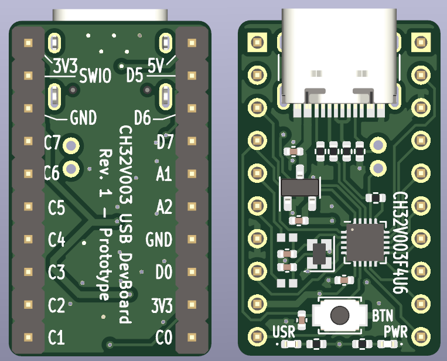
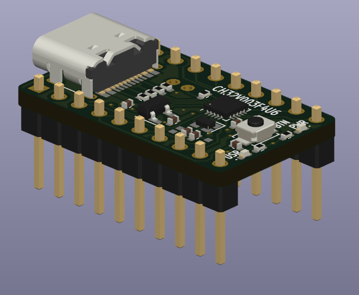

# CH32V003-USB-DevBoard

## Description

This is a CH32V003 USB-capable dev board (Prototype Stage).

It features:
* USB-C connector
* Optional Crystal
* User Button at PD7 (also for Reset)
* User LED at PC0
* USB (bit-bang) on PD3/PD4

## Sponsors

[AISLER](https://aisler.net/) is the sponsor for the prototypes and the first batch of PCBs!

You can get PCBs manufactured in two business days starting at just 12.13€.
Use the code `alexander_m_23` to get 5€ off your next order!

## Purchase

If you want to have some assembled boards, you can purchase them on [Lectronz](https://www.lectronz.com/products/ch32v003-usb-development-board)!

## Images

